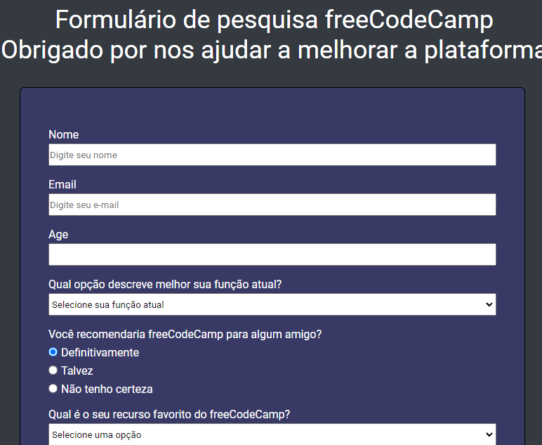

# Projeto Formulário de pesquisa 🔎

<!---Esses são exemplos. Veja https://shields.io para outras pessoas ou para personalizar este conjunto de escudos. Você pode querer incluir dependências, status do projeto e informações de licença aqui--->

> Formulário de pesquisa inspirado no site de programadores freeCodeCamp

##
Tecnologias usadas:
  
 <a href="https://developer.mozilla.org/pt-BR/docs/Web/HTML" target="_blank">HTML</a>;
  
 <a href="https://developer.mozilla.org/pt-BR/docs/Web/CSS" target="_blank">CSS</a>;
  
## 
🤝 Colaboradores:

<a href="https://www.linkedin.com/in/marcusviniciusbeghelisantos/" target="_blank">Marcus Vinícius</a>

